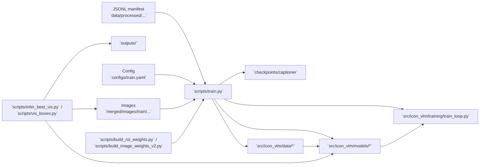

# ICON Captioner Overview

## Purpose
This project implements a model pipeline for detecting icon-like ROIs in images and generating a text caption for each ROI.

## Key directory structure

- `configs/`
  - `train.yaml`: main configuration file for training, evaluation, and model paths.

- `checkpoints/`
  - `yolo/`: pretrained YOLO model weights.
  - `captioner/`: captioning model checkpoints.

- `data/`
  - `processed/icon_caption_jsonl_gt/`: JSONL manifests used for training and evaluation.
  - `merged/images/train/`: source training images referenced by manifests.

- `scripts/`: script entrypoints and utility/debug tools.
- `src/icon_vlm/`: core implementation of the model, data processing, and training logic.

## Data input/output format

### Manifest format
Each line in the JSONL manifest describes one image and all ROIs inside it.

```json
{
  "image_path": "...",
  "boxes_xyxy": [[x1, y1, x2, y2], ...],
  "texts": ["settings", "wifi", ...]
}
```

- `image_path`: the original image file path.
- `boxes_xyxy`: ROI boxes in original image coordinates.
- `texts`: text labels corresponding to each box.

## High-level execution flow

### Architecture diagram



### 1. Training flow

#### Entry point
- `scripts/train.py`

#### Responsibilities
- Load configuration from `configs/train.yaml`
- Create the tokenizer
- Load ROI-level samples through `ROIFlatDataset`
- Optionally balance sampling with `train_roi_weights.json` and `WeightedRandomSampler`
- Initialize `YoloIconCaptioner`
- Run `train_loop.train_one_epoch` and `train_loop.eval_one_epoch`
- Save epoch checkpoints and update the best model

#### Key connections
- `scripts/train.py` → `src/icon_vlm/data/roi_flat_dataset.py`
- `scripts/train.py` → `src/icon_vlm/models/yolo_captioner.py`
- `scripts/train.py` → `src/icon_vlm/training/train_loop.py`

#### Data flow
1. `ROIFlatDataset` reads JSONL and returns each image-ROI sample as:
   - letterboxed image tensor
   - letterbox ROI box
   - tokenized text IDs
2. `DataLoader` batches these samples.
3. `YoloIconCaptioner.forward_train(...)` receives the batch and:
   - generates YOLO features
   - extracts ROI tokens with ROIAlign
   - runs the transformer decoder to produce logits and compute loss
4. The training loop updates the model via the optimizer.

### 2. Inference flow

#### Entry points
- `scripts/infer.py`: simple single-image inference and visualization
- `scripts/infer_best_vis.py`: checkpoint-based batch inference and benchmark
- `scripts/vis_boxes.py`: box/text visualization on one image

#### Responsibilities
- All inference scripts use `YoloIconCaptioner.forward_infer(...)` to:
  - preprocess input image with letterbox
  - run YOLO prediction and NMS
  - extract ROI features via ROIAlign
  - perform greedy decoder text generation
  - map boxes back to original coordinates

#### Data flow
1. Load input image
2. Use `models/preprocess.py` `letterbox` to resize and pad
3. `models/yolo_captioner.py` obtains YOLO features and raw predictions
4. `decode_pred_to_det` and `nms_xyxy` filter detection candidates
5. `models/roi.py` `roi_tokens_roi_align` converts feature maps to ROI tokens
6. `models/decoder.py` `TinyTransformerDecoder` generates ROI text

## `src/icon_vlm` structure summary

### `src/icon_vlm/models`
- `yolo_captioner.py`
  - Core model implementation.
  - Manages YOLO backbone, feature extraction, ROIAlign, and decoder integration.
  - Exposes `forward_infer`, `forward_train`, and `forward_train_decode`.

- `tokenizer.py`
  - Character-level tokenizer.
  - Converts strings to token IDs and back.

- `preprocess.py`
  - Letterbox preprocessing and coordinate conversion.
  - Converts between original and letterbox box coordinates.

- `roi.py`
  - Extracts ROI tokens from feature maps using `torchvision.ops.roi_align`.

- `decoder.py`
  - Tiny transformer decoder.
  - Supports training via `forward_train` and greedy inference via `forward_greedy`.

### `src/icon_vlm/data`
- `datasets.py`
  - `IconCaptionDataset` for image-level JSONL samples.
  - Preprocesses image and ROI data per image.

- `roi_flat_dataset.py`
  - `ROIFlatDataset` flattens JSONL into one ROI sample per example.
  - Used for ROI-level training and evaluation.

- `collate.py`
  - Batches image-level samples.
  - Keeps GT boxes as a list and flattens text token tensors.

- `collate_roi_flat.py`
  - Batches ROI-flat samples.
  - Produces `images`, `gt_boxes_list`, and `gt_text_ids`.

### `src/icon_vlm/training`
- `train_loop.py`
  - Implements `train_one_epoch` and `eval_one_epoch`.
  - Includes AMP support, loss and token accuracy computation, and validation sample logging.

## `scripts/` role breakdown

### Training / evaluation
- `scripts/train.py`: runs the full training pipeline.
- `scripts/eval_ckpt_decode.py`: loads checkpoints and prints GT vs predicted captions.
- `scripts/overfit_one_batch.py`: verifies training by overfitting a single batch.

### Balancing / sampling
- `scripts/build_image_weights.py`: computes image-level sample weights.
- `scripts/build_image_weights_v2.py`: computes image weights with multiple aggregation modes.
- `scripts/build_roi_weights.py`: computes ROI-level sample weights.
- `scripts/check_balanced_sampling.py`: compares label distribution under balanced sampling.

### Debug / visualization
- `scripts/debug_pred_format.py`: checks raw YOLO output format.
- `scripts/check_decode_and_crop.py`: verifies predictions and crop visualization.
- `scripts/debug_preprocess_roi.py`: checks letterbox and ROI preprocessing.
- `scripts/print_layers.py`: prints the YOLO layer structure.
- `scripts/smoke_test_captioner.py`: performs a quick captioner smoke test.
- `scripts/vis_boxes.py`: draws predicted boxes and text on an image.

### Data utilities
- `scripts/patch_jsonl_paths.py`: patches manifest image path prefixes.

## Entry points summary

- Training: `python scripts/train.py` or `python -m scripts.train`
- Inference: `python scripts/infer.py`, `python scripts/infer_best_vis.py`, `python scripts/vis_boxes.py`
- Debug/verification: `python scripts/debug_preprocess_roi.py`, `python scripts/overfit_one_batch.py`, `python scripts/debug_pred_format.py`

## Suggested workflow

1. `pip install -r requirements.txt`
2. Prepare `checkpoints/yolo/best.pt`
3. Prepare `data/processed/icon_caption_jsonl_gt/train.jsonl` and `val.jsonl`
4. Generate sampling weights via `scripts/build_roi_weights.py` or `scripts/build_image_weights_v2.py`
5. Train with `scripts/train.py`
6. Inspect inference outputs with `scripts/infer_best_vis.py` or `scripts/vis_boxes.py`

## Summary

This repository uses `scripts/` as execution entry points while keeping implementation details in `src/icon_vlm/`. `train.py` and `infer*.py` assemble the pipeline, with `data/`, `configs/`, `checkpoints/`, and `outputs/` handling input data, configuration, saved models, and result storage respectively.
